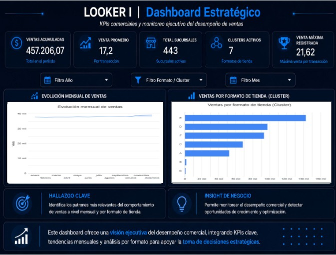
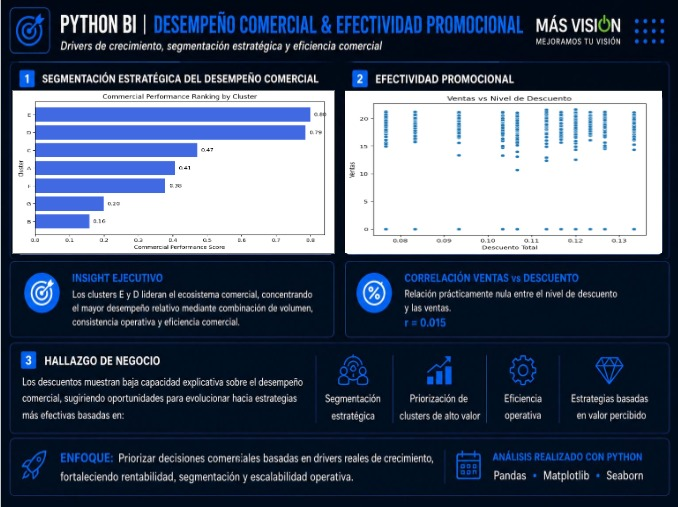
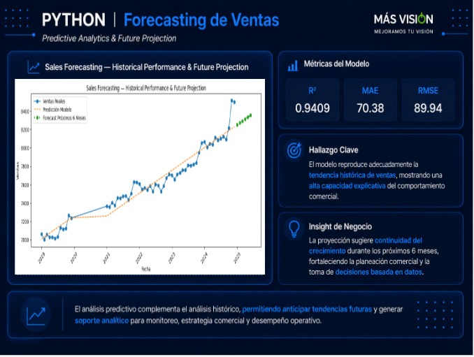

# 📊 Más Visión Commercial Analytics & Sales Forecasting

---

## Overview

This project analyzes historical commercial sales data from Más Visión between 2019 and 2024 to identify business trends, evaluate operational performance, detect growth opportunities, and forecast future sales behavior.

Using Excel, Python, Looker Studio, and Machine Learning techniques, raw transactional data was transformed into actionable business insights that support strategic decision-making and commercial optimization.

---

## Business Problem

Retail organizations generate large volumes of transactional data every day. However, transforming that information into strategic decisions that improve commercial performance remains a significant challenge.

Understanding sales behavior, identifying high-performing store formats, detecting operational opportunities, and anticipating future demand are essential to maximize profitability and business growth.

### Business Question

How can historical sales data be leveraged to identify growth drivers, optimize commercial performance, improve operational efficiency, and forecast future sales trends?

---

## Project Objectives

- Analyze historical sales performance between 2019 and 2024.
- Identify commercial trends and seasonality patterns.
- Evaluate store cluster and format performance.
- Detect operational opportunities through data analysis.
- Measure promotional effectiveness.
- Generate business KPIs.
- Build executive dashboards.
- Develop predictive sales forecasting models.
- Support data-driven decision-making.

---

## Data Source

### Dataset

Commercial sales dataset containing:

- Sales transactions
- Store clusters
- Store formats
- Sales amounts
- Discount information
- Transaction dates
- Commercial performance indicators

### Data Structure

- Structured transactional records
- Historical sales data
- Multiple commercial segments
- Multi-year business information

---

## Tools & Technologies

- Excel
- Python
- Pandas
- NumPy
- Matplotlib
- Seaborn
- Scikit-Learn
- Looker Studio
- Machine Learning
- Git & GitHub

---

## Methodology

### 1. Data Exploration in Excel

Initial business analysis was conducted using:

- Pivot tables
- Sales comparisons
- Cluster performance analysis
- Top-performing stores identification
- Historical trend evaluation

### 2. Data Cleaning & Transformation

Python and Pandas were used to:

- Validate data quality
- Remove duplicates
- Handle missing values
- Standardize variables
- Create analytical features

### 3. Exploratory Data Analysis (EDA)

EDA techniques were applied to:

- Analyze sales distributions
- Detect seasonality patterns
- Evaluate cluster performance
- Study discount effectiveness
- Identify correlations between variables
- Detect potential outliers

### 4. Commercial Segmentation

Commercial performance was analyzed by:

- Store clusters
- Store formats
- Relative performance
- Revenue contribution

This segmentation enabled the identification of high-value commercial groups and operational opportunities.

### 5. Sales Forecasting

A forecasting model was developed to estimate future sales behavior based on historical commercial trends.

The model supports demand planning and strategic decision-making.

### 6. Business Intelligence Dashboard

Interactive dashboards were developed in Looker Studio to visualize:

- Commercial KPIs
- Sales evolution
- Cluster performance
- Operational comparisons
- Strategic business insights

---

## Key Findings

### Sustained Commercial Growth

Sales demonstrated a consistent upward trend throughout the analyzed period, reaching peak performance levels in 2024.

### Cluster E Outperformed Other Segments

Cluster E generated the highest commercial contribution, becoming the primary driver of sales performance across the organization.

### Strong Seasonality Patterns

Recurring monthly patterns revealed opportunities for demand planning, inventory optimization, and commercial campaign scheduling.

### Limited Promotional Impact

The relationship between discounts and sales performance was relatively weak, suggesting that factors beyond discount levels play a more significant role in commercial outcomes.

### Commercial Performance Concentration

A limited number of stores contributed a substantial proportion of total sales, highlighting opportunities to replicate successful practices across other locations.

---

## Dashboard & Visualizations

### Executive Commercial Dashboard

<p align="center">
  
</p>

### Commercial Segmentation Analysis

<p align="center">
  
</p>

### Sales Forecasting Model

<p align="center">
  
</p>

---

## Business Impact

The insights generated by this project support:

- Improved commercial decision-making.
- Better resource allocation.
- Identification of high-performing store clusters.
- Enhanced sales monitoring through KPIs.
- Improved demand planning.
- Forecast-driven business strategies.
- Continuous performance optimization.

---

## Project Limitations

- Analysis relies on historical data available through 2024.
- External economic and market factors were not incorporated.
- Customer-level behavioral variables were unavailable.
- Forecast accuracy may be improved using more advanced Machine Learning models.
- Promotional campaign information beyond discounts was not available.

---

## Lessons Learned

Throughout this project, I strengthened my skills in:

- Commercial Analytics
- Business Intelligence
- Exploratory Data Analysis
- Data Visualization
- Sales Forecasting
- KPI Development
- Executive Dashboard Design
- Strategic Business Analysis

---

## Challenges

- Integrating multi-year sales information.
- Standardizing commercial records.
- Detecting meaningful business patterns.
- Evaluating promotional effectiveness.
- Translating analytical findings into business recommendations.
- Building dashboards for executive stakeholders.

---

## Recommendations

- Replicate successful strategies from top-performing clusters.
- Strengthen initiatives for lower-performing store groups.
- Use seasonality insights for demand planning.
- Expand forecasting capabilities through advanced Machine Learning techniques.
- Continuously monitor KPIs using interactive dashboards.
- Incorporate customer and operational variables into future analyses.

---

## Conclusion

This project demonstrates how commercial analytics, business intelligence, and predictive modeling can transform raw sales data into strategic business value. By combining Excel, Python, Looker Studio, and forecasting techniques, key growth drivers were identified, operational opportunities were uncovered, and actionable insights were generated to support smarter commercial decision-making.

---

## Repository Structure

```text
masvision-sales-analytics-bi
├── README.md
├── data
│   └── mas_vision_sales_data.xlsx
├── notebooks
│   └── masvision_analysis.ipynb
├── dashboard
│   └── looker_dashboard.pdf
└── presentation
    └── executive_presentation.pdf
└── Images
    ├── executive-dashboard.png
    ├── commercial-segmentation-analysis.png
    └── sales-forecasting-model.png

```

---

## Author

*Ali Vega*

Data Analyst | Business Intelligence | Python | SQL | Data Visualization
